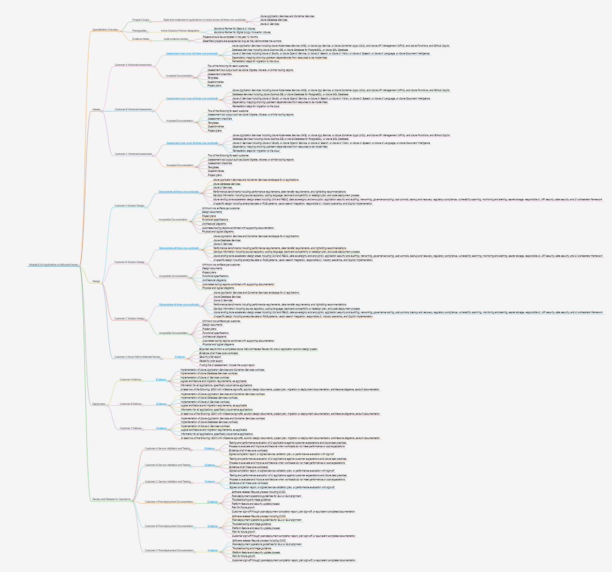

# Specialization audit requirements as graph / markmaps

Collection of Markmaps* of select Specializations.

\* Markmaps are Markdown documents that can be rendered as a mindmap / graph.

Use-cases:

* A structured, more "graphical" view of the audit checklist
* Versionable "base document" to track progress (just edit the Markdown to add check indicators)
* Context (already graph-based) that agents will appreciate :)

Pre-requisites:

Any tool that can render Markdown / Markmap will be able to be useful with these files.

Recommended tools:

* Visual Studio Code, with Markmap extension